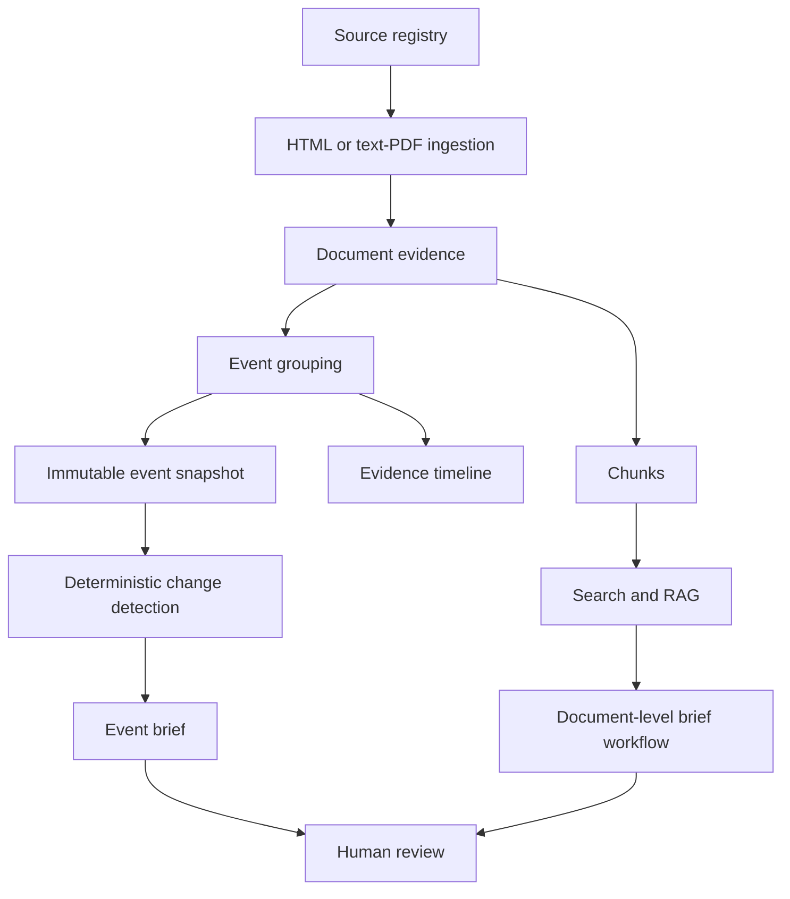

# AI Diplomacy Briefing Assistant

**Event-Based Policy and Media Intelligence**

AI Diplomacy Briefing Assistant is a functional local prototype for evidence-first media and policy monitoring. It ingests public HTML pages and text-based PDFs, preserves the source documents as evidence, groups related documents into events, creates event snapshots, detects changes between event states, and generates reviewable event briefs.

The project is built for policy, government-affairs, public-diplomacy, embassy, international-organization, technology-policy, and research workflows where users need to understand what happened, what changed, why it matters, which sources support the conclusion, and where evidence is still incomplete.

It is not production-ready, enterprise-ready, or an autonomous publishing system. It is best described as an advanced proof of concept and portfolio/research project for local event intelligence.

## Why Event Intelligence

Article-by-article monitoring creates repetition. Several outlets or institutions may describe the same real-world development, and isolated article summaries can make analysts reread the same story without seeing how the evidence set changed.

This application keeps documents as the inspectable evidence layer, then groups related documents into events so users can review the development as a whole:

- **Source**: a registered institution, publisher, outlet, or manually created source entry.
- **Document**: one ingested HTML page or text-based PDF with extracted text and metadata.
- **Event**: a deterministic grouping of related documents about the same development.
- **Event Snapshot**: an immutable captured state of an event and its evidence at a point in time.
- **Event Brief**: a generated, reviewable summary grounded in one event snapshot.

Original documents remain available as evidence. Event-level analysis does not replace source inspection.

## Current Capabilities

Verified in the repository:

- source management and reuse for existing source names;
- curated public-source seed pack;
- HTML URL ingestion with text extraction and fallback page-text extraction;
- text-based PDF ingestion through `pypdf`;
- Japanese and multilingual Unicode preservation in sanitation and PDF tests;
- NUL-byte and invalid-control-character sanitation before persistence;
- concise PDF/ingestion errors for scanned, malformed, encrypted, oversized, timeout, and unsupported-content cases;
- exact URL duplicate rejection at document ingestion;
- event assignment with normalized URL, content hash, normalized title, and TF-IDF/character-ngram similarity checks;
- document chunking with existing chunks preserved for citation stability;
- local TF-IDF retrieval and optional OpenAI/pgvector retrieval;
- RAG question answering over chunks;
- document-level policy brief generation and review;
- Markdown export for document-level briefs;
- audit logs for major workflow actions;
- Events page with filters, source/publisher coverage, and evidence timeline;
- immutable event snapshots;
- deterministic snapshot comparison and change levels;
- event-level brief generation from snapshot evidence;
- deterministic event-brief fallback without a model provider;
- optional LLM-assisted wording when configured;
- event-brief review workflow;
- operational dashboard;
- PostgreSQL persistence with SQLAlchemy models;
- FastAPI backend and Streamlit frontend;
- automated pytest coverage for sources, ingestion/PDF handling, events, event intelligence, brief review, and frontend static helpers.

## Product Flow

```text
Source
  -> Document
  -> Validation, sanitation, and deduplication
  -> Event
  -> Evidence timeline
  -> Event snapshot
  -> Change detection
  -> Event brief
  -> Human review
```

The evidence layer is the set of source records and documents. Snapshots and briefs are derived from that evidence and should be reviewed before use.

## Intended Use Cases

- Japanese AI and digital-policy monitoring.
- Government-affairs and regulatory intelligence.
- Embassy and international-organization briefing preparation.
- Technology-policy and AI-governance research.
- Multilingual institutional-source monitoring.
- Internal public-diplomacy or policy-team draft brief workflows.

The repository does not claim current customers, production deployments, institutional endorsements, or commercial traction.

## Architecture

Actual stack:

- **Backend**: FastAPI, Pydantic, SQLAlchemy.
- **Frontend**: Streamlit single-page app in `frontend/streamlit_app.py`.
- **Database**: PostgreSQL with pgvector via Docker Compose.
- **Ingestion**: `requests`, `trafilatura`, BeautifulSoup, `pypdf`.
- **Retrieval**: local TF-IDF with scikit-learn, or optional OpenAI embeddings with pgvector.
- **Event grouping**: deterministic URL/content/title checks plus TF-IDF character n-gram similarity.
- **Briefing**: deterministic local fallback, optional OpenAI chat model integration.
- **Testing**: pytest with SQLite-backed service/API tests.



## Screenshots

The committed screenshots in `docs/screenshots/` show the earlier document/RAG briefing workflow: Start Here, Dashboard, Source Pack, Documents, Ask Knowledge Base, Generate Brief, Review Briefs, Audit Logs, and Governance.

They do not currently show the v0.10.0 Events UI, event snapshots, change intelligence, event briefs, or PDF ingestion. See [docs/screenshots/V0_10_SCREENSHOT_CHECKLIST.md](docs/screenshots/V0_10_SCREENSHOT_CHECKLIST.md) for the required current screenshot capture checklist.

## Quick Start

Requirements:

- Python 3.11+
- Docker Desktop or compatible Docker Compose runtime

Clone and enter the repository:

```bash
git clone <repository-url>
cd ai-diplomacy-briefing-assistant
```

Create and activate one virtual environment from the repository root:

```bash
python3 -m venv .venv
source .venv/bin/activate
```

Install backend and frontend requirements:

```bash
python3 -m pip install -r backend/requirements.txt
python3 -m pip install -r frontend/requirements.txt
```

Optional local configuration:

```bash
cp .env.example .env
```

The default code path runs in local deterministic mode without an API key. Edit `.env` only if you need custom database settings or OpenAI-backed retrieval/briefing.

Start PostgreSQL:

```bash
docker compose up -d db
```

Start FastAPI from the backend directory:

```bash
cd backend
python3 -m uvicorn app.main:app --reload --port 8002
```

In another terminal, start Streamlit from the repository root:

```bash
source .venv/bin/activate
python3 -m streamlit run frontend/streamlit_app.py --server.port 8501
```

Open:

- FastAPI Swagger: `http://localhost:8002/docs`
- Streamlit app: `http://localhost:8501`

Initialize the database:

```bash
curl -X POST http://localhost:8002/admin/init-db
```

For existing databases created before the event tables, apply the additive SQL migrations manually before using event intelligence:

```bash
psql "$DATABASE_URL" -f backend/migrations/versions/20260702_0900_phase_9a_events.sql
psql "$DATABASE_URL" -f backend/migrations/versions/20260702_1200_phase_9c_event_snapshots_briefs.sql
```

Optional event backfill for older documents:

```bash
curl -X POST "http://localhost:8002/admin/events/backfill?dry_run=true"
curl -X POST "http://localhost:8002/admin/events/backfill?dry_run=false"
```

Stop services:

- Press `Control+C` in the FastAPI and Streamlit terminals.
- To stop PostgreSQL without deleting data:

```bash
docker compose stop db
```

## Environment Variables

The backend configuration is defined in `backend/app/core/config.py`. The frontend reads `API_BASE_URL` and otherwise defaults to `http://localhost:8002`.

Common variables:

- `DATABASE_URL`: optional override for PostgreSQL connection settings.
- `EMBEDDING_PROVIDER`: `local` or `openai`; default is `local`.
- `ANSWER_PROVIDER`: `local` or `openai`; default is `local`.
- `OPENAI_API_KEY`: optional; required only when OpenAI providers are enabled.
- `OPENAI_EMBEDDING_MODEL`: default `text-embedding-3-small`.
- `OPENAI_CHAT_MODEL`: default `gpt-4.1-mini`.
- `DEFAULT_TOP_K`: default search result count.
- `EVENT_NEAR_DUPLICATE_TITLE_THRESHOLD`: default `0.92`.
- `EVENT_SEMANTIC_SIMILARITY_THRESHOLD`: default `0.78`.
- `EVENT_TITLE_MATCH_WINDOW_DAYS`: default `14`.
- `INGESTION_REQUEST_TIMEOUT_SECONDS`: request timeout for ingestion downloads.
- `INGESTION_MAX_DOWNLOAD_BYTES`: maximum downloaded response size.
- `INGESTION_MAX_EXTRACTED_TEXT_CHARS`: maximum persisted extracted text length.
- `INGESTION_ERROR_MAX_CHARS`: maximum public ingestion error length.
- `API_BASE_URL`: frontend backend URL override.

Local mode works without an API key. If an OpenAI provider is selected and the key is missing or invalid, document-level generation errors and event-level brief generation falls back to deterministic wording where implemented.

## First-Use Workflow

1. Start PostgreSQL, FastAPI, and Streamlit.
2. Initialize the database from System Status or `POST /admin/init-db`.
3. Load the curated source pack or create a source.
4. Ingest an HTML page or text-based PDF.
5. Inspect the document and create chunks if you need search/RAG/document-level briefs.
6. Run event backfill if the document was created before event assignment existed.
7. Open Events and inspect event evidence.
8. Create an event snapshot explicitly.
9. Generate an event brief explicitly.
10. Review the brief before using it.

Snapshots and event briefs are not generated automatically during ordinary page loads.

## API Overview

Swagger is available at `http://localhost:8002/docs`.

Route groups:

- `GET /health`
- `POST /admin/init-db`
- `GET /admin/seed-sources`
- `POST /admin/load-seed-sources`
- `POST /admin/ingest-seed-source`
- `POST /admin/ingest-seed-sources-batch`
- `GET /admin/recommended-seed-sources`
- `POST /admin/demo-setup`
- `POST /admin/events/backfill`
- `GET/POST /sources`
- `POST /ingest/url`
- `GET /documents`
- `GET /documents/{document_id}`
- `GET /documents/{document_id}/chunk-status`
- `POST /documents/{document_id}/chunk`
- `POST /documents/{document_id}/embed`
- `GET /events`
- `GET /events/{event_id}`
- `GET /events/{event_id}/documents`
- `POST /events/recluster/{document_id}`
- `POST /events/{event_id}/snapshots`
- `GET /events/{event_id}/snapshots`
- `GET /events/{event_id}/snapshots/latest`
- `GET /events/{event_id}/changes`
- `POST /events/{event_id}/briefs/generate`
- `GET /events/{event_id}/briefs`
- `GET /event-briefs/{brief_id}`
- `PATCH /event-briefs/{brief_id}/review`
- `GET /search`
- `POST /rag/answer`
- `POST /brief-generator/generate`
- `GET /briefs`
- `GET /briefs/{brief_id}`
- `PATCH /briefs/{brief_id}/review`
- `POST /export/brief/{brief_id}/markdown`
- `GET /audit-logs`
- `GET /dashboard/metrics`

## Testing

Run the full suite from the repository root with the virtual environment active:

```bash
pytest
```

Useful validation commands for documentation and import sanity:

```bash
python3 -m compileall backend/app frontend tests
git diff --check
```

## Reliability and Safety Behavior

- Raw PDF bytes are not stored in PostgreSQL text fields.
- NUL bytes and invalid control characters are sanitized before persistence.
- Text-based PDFs are supported.
- Image-only or scanned PDFs return an OCR-not-supported error.
- Malformed, encrypted, oversized, and unsupported documents fail before persistence where covered by ingestion validation.
- Streamlit sanitizes sensitive backend error details before display.
- Snapshot comparisons are deterministic before any LLM-assisted wording.
- Event brief evidence is limited to documents in the relevant snapshot.
- Deterministic event-brief fallback works without a model provider.
- LLM-generated content remains draft output and is not automatically approved.

## Known Limitations

- No OCR or scanned-PDF text recognition.
- No PDF table, chart, image, or layout reconstruction.
- No autonomous scheduled monitoring.
- No alerts or watchlists.
- No source-reliability scoring beyond stored source metadata.
- Distinct publishers are not automatically proven to be independent sources.
- No manual event merge/delete workflow.
- No multi-tenant authentication, authorization, or access control.
- No SSRF hardening for arbitrary URL ingestion.
- Dependencies are not pinned for reproducible production builds.
- Local TF-IDF retrieval is deterministic but limited and not full multilingual semantic event resolution.
- Document-level brief citations reference live chunk rows rather than immutable generation-time citation snapshots.
- Model-generated output depends on provider configuration and response quality.
- The FastAPI metadata version in application code still reports an older API version; this v0.10.0 release is documentation-focused and does not modify application source.
- Local-development orientation; no production deployment guarantees.

## Roadmap

- Scheduled monitoring and source refresh.
- OCR for scanned PDFs.
- Stronger multilingual event resolution.
- Analyst controls for event merging and correction.
- Alerts and watchlists.
- Source-reliability metadata and review controls.
- Authentication and access control.
- Production deployment, observability, and secret-management guidance.
- Retrieval and briefing evaluation sets.

## Documentation

- [Documentation index](docs/README.md)
- [Current v0.10.0 release notes](docs/RELEASE_NOTES_V0.10.0.md)
- [Changelog](CHANGELOG.md)
- [Phase 9A Event Intelligence Foundation](docs/PHASE_9A_EVENT_INTELLIGENCE.md)
- [Phase 9B Events UI](docs/PHASE_9B_EVENT_UI.md)
- [Phase 9C Change Intelligence](docs/PHASE_9C_CHANGE_INTELLIGENCE.md)
- [Phase 10A Reliable PDF Ingestion](docs/PHASE_10A_PDF_INGESTION.md)
- [Screenshot checklist](docs/screenshots/V0_10_SCREENSHOT_CHECKLIST.md)
- [GitHub release draft](docs/GITHUB_RELEASE_V0.10.0.md)
- [Architecture notes](docs/CURRENT_ARCHITECTURE.md)
- [Portfolio case study](docs/portfolio/CASE_STUDY.md)

## License

MIT. See [LICENSE](LICENSE).
