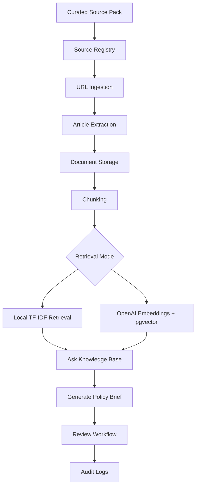

# Architecture

## System Overview

## Main Components

### Frontend

Streamlit provides a simple UI for:

- source pack loading
- source library
- URL ingestion
- document preview
- chunk status
- question answering
- brief generation
- review workflow
- audit logs

### Backend

FastAPI provides endpoints for:

- health check
- database initialization
- sources
- documents
- ingestion
- search
- RAG answer generation
- brief generation
- review status updates
- audit logs

### Database

PostgreSQL stores:

- sources
- documents
- chunks
- briefs
- brief_sources
- audit_logs

pgvector is included for production-like vector search.

### Retrieval

The app supports two retrieval modes:

1. **Local mode**
   - TF-IDF retrieval
   - no API billing
   - reproducible demo mode

2. **OpenAI mode**
   - OpenAI embeddings
   - pgvector similarity search
   - production-like semantic retrieval

### Answer Generation

The app supports two answer modes:

1. **Local answer mode**
   - extractive answer based on retrieved chunks
   - no API billing

2. **OpenAI answer mode**
   - LLM-generated synthesis using retrieved chunks
   - source-cited answer

## Database Tables

### sources

Stores approved source registry entries.

Key fields:

- name
- base_url
- source_type
- reliability_tier
- country_or_institution
- notes
- is_active

### documents

Stores ingested source pages.

Key fields:

- title
- url
- source_id
- cleaned_text
- topic_tags
- sensitivity_level
- status

### chunks

Stores source chunks.

Key fields:

- document_id
- chunk_index
- content
- token_count
- embedding

### briefs

Stores generated policy briefs.

Key fields:

- title
- brief_type
- query_or_topic
- content
- sensitivity_level
- confidence_level
- review_status
- reviewer_notes

### brief_sources

Maps briefs to source chunks.

Key fields:

- brief_id
- document_id
- chunk_id
- citation_label

### audit_logs

Records major actions.

Key fields:

- actor
- action
- entity_type
- entity_id
- details
- created_at

## Governance-Aware Design

The architecture supports governance by design:

- curated source registry;
- reliability tiers;
- draft-only generated briefs;
- human review workflow;
- senior review option;
- audit logs;
- stable citation mapping;
- local reproducibility mode.
